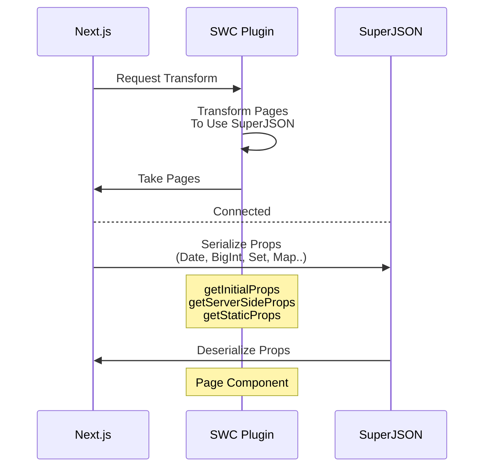

# 🔌 NEXT SUPERJSON PLUGIN

```jsx
export default function Page({ date }) {
  return (
    <div>
      Today is {date.toDateString()}
    </div>
  )
}

// You can also use getInitialProps, getStaticProps
export const getServerSideProps = () => {
  return {
    props: {
      date: new Date()
    }
  }
}
```

<p align="middle">
<strong> SWC Plugin for Next.js (Canary Recommended)</strong>
</p>

This plugin allows the pre-rendering functions to return props **including complex objects(Date, Map, Set..) that cannot be serialized by standard JSON.**

**👀 See [how it works](#how-it-works)**

**Supported object types: [Here](https://github.com/blitz-js/superjson#parse)**

## Usage

Install packages first:

```sh
npm install superjson next-superjson-plugin
# or Yarn
yarn add superjson next-superjson-plugin
```

Add the plugin into `next.config.js`

```js
// next.config.js
module.exports = {
  experimental: {
    swcPlugins: [
      ['next-superjson-plugin', {}],
    ],
  },
}
```

### Options
You can use the `excluded` option to exclude specific properties from serialization.
```js
['next-superjson-plugin', { excluded: ["someProp"] }],
```

## How it works



## Contributing

[Leave an issue](https://github.com/orionmiz/next-superjson-plugin/issues)

## Special Thanks
- [kdy1](https://github.com/kdy1) (Main creator of swc project)
