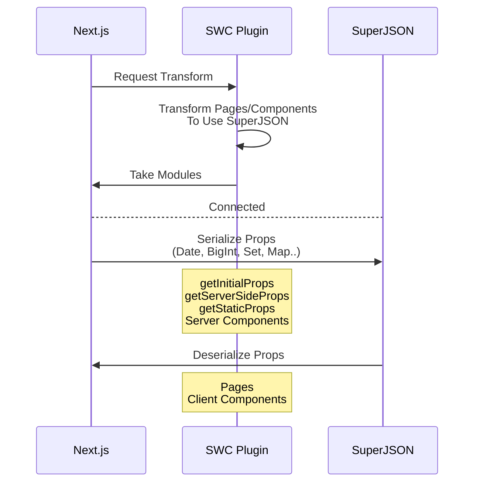

<h1 align="middle"> Next SuperJSON Plugin</h1>
<h3 align="middle">🔌 SuperJSON Plugin for Next.js (SWC)</h3>

### /pages (Pages Directory)

```jsx
export default function Page({ date }) {
  return <div>Today is {date.toDateString()}</div>;
}

// You can also use getInitialProps, getStaticProps
export const getServerSideProps = () => {
  return {
    props: {
      date: new Date(),
    },
  };
};
```

- Allows pre-rendering functions to return props including [Non-JSON Values](https://github.com/blitz-js/superjson#parse)(Date, Map, Set..)

### /app (App Directory)

```jsx
// Use "data-superjson" attribute to pass non-serializable props to client components
// No needs to change the propsType of Client Component (It's type-safe!)

export default function ServerComponent() {
  const date = new Date();
  return <ClientComponent date={date} data-superjson />;
}
```

- Provides `data-superjson` attribute for [Server Component > Client Component Serialization](https://beta.nextjs.org/docs/rendering/server-and-client-components#passing-props-from-server-to-client-components-serialization).

## Usage

Install packages first:

```sh
npm install superjson next-superjson-plugin
# or Yarn
yarn add superjson next-superjson-plugin
```

Add the plugin into `next.config.js`

```js
// next.config.js
module.exports = {
  experimental: {
    swcPlugins: [["next-superjson-plugin", {}]],
  },
};
```

### Options

You can use the `excluded` option to exclude specific properties from serialization.

```js
['next-superjson-plugin', { excluded: ["someProp"] }],
```

## How it works



## Bug Report

⚠️ Keep in mind: SWC Plugin is still an experimental feature for Next.js

Plugin always ensures compatibility with [Next.js Canary version](https://nextjs.org/docs/messages/opening-an-issue) only.

[Leave an Issue](https://github.com/orionmiz/next-superjson-plugin/issues)

## Special Thanks

- [kdy1](https://github.com/kdy1) (Main creator of swc project)
